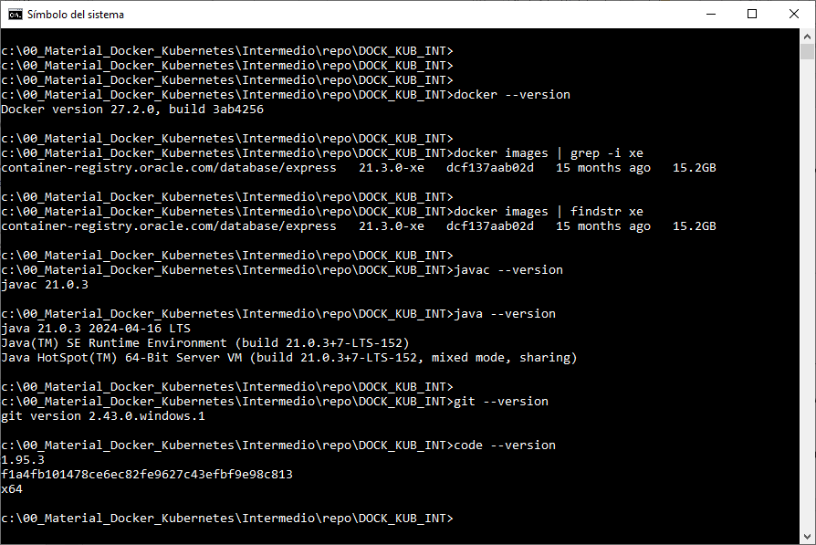

# Práctica 1.1 Verificación de Entorno de Curso

## Objetivo

Al finalizar esta práctica, serás capaz de verificar y preparar el entorno necesario para el curso, asegurándote de que Docker y las herramientas complementarias estén correctamente instaladas y configuradas para el desarrollo de actividades posteriores.

## Duración

15 minutos


## Instrucciones

1. Sigue atentamente las indicaciones del instructor para conectarse al ambiente asignado y asegurate de que todo esté correctamente configurado.

<br/>

2. Verificar Docker CLI
    Abre una terminal y ejecuta el comando siguiente:

    ```cmd
    docker --version
    ```

    Confirma que Docker está instalado y muestra la versión.

<br/>

3. Vericar Java SDK

    Ejecuta los siguiente comandos:

    ```cmd
    javac --version
    java --version
    ```
    Asegúrate de que ambas herramientas están disponibles, de preferencia Java 21.

<br/>

4. Verificar Git

    En la terminal, ejecuta:

    ```cmd
    git --version
    git config --global user.name "tu_nombre"
    git config --global user.email "tu_correo"
    git config --list
    ```
    La configuración de tu nombre y correo son opcionales, pero si tu instructor te pidiera subir algo algún repositorio es ahí cuando serían necesarias.

<br/>

5. Verificar Spring Tool Suite (STS):

    Abre STS desde su acceso directo y verifica que cargue correctamente.

<br/>

6. Verificar la imagen de Oracle DB en Docker:

    En la terminal, ejecuta:

    ```cmd
    docker images
    ```

<br/>

7. Veriricar Postman, Insomnia y Curl CLI.

    - Abre Postman e Insomia desde sus accesos directos y verifica que ambos funcionen correctamente.

    - En la terminal, ejecuta:

    ```cmd
    curl --version
    ```

<br/>

8. Verificar Visual Studio Code & Nodepad++

    Abre ambos programas desde sus accesos directos y asegúrate de que se carguen sin problemas. No actualices las versiones si lo solicita.

<br/>

9. Verificar conexión SSH a los nodos:

    - Accede a cada nodo utilizando SSH y confirma que puedes conectarte correctamente.

    - Por ejemplo:

    ```cmd
    ssh usuario@ip_nodo_maestro

    ssh usuario@ip_nodo_worker
    ```

<br/>

10. Registrar las IPs de los nodos:

    Usa el comando siguiente en cada nodo para identificar su dirección IP

    ```bash

    ip addr show
    ```

    Anota las IPs y confirma que están dentro de la misma red.

<br/>

11. Verificar Kubernetes (nodo maestro y worker)

    - En la terminal del nodo maestro, ejecuta:

    ```cmd
    kubectl version

    kubectl get nodes
    ```

    Confirma que ambos nodos están visible y en estado `Ready`

<br/>

12. Clonar el repositorio del curso

    Clonar el repositorio proporcionado por el instructor para acceder a los archivos de práctica. Puedes hacerlo con:

    ```cmd

    git clone <URL del repositorio>
    ```

<br/>
<br/>

## Resultado Esperado

- La siguente captura de pantalla muestra solo algunas de las versiones de las herramientas usadas en el curso.



- Al finalizar, confirma con el instructor que todas las verificaciones se han completado correctamente.