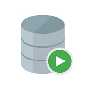
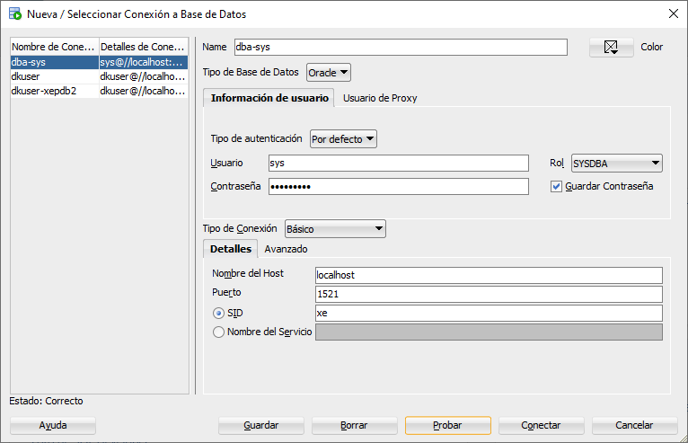

# Práctica 1.4 Oracle Container

## Objetivo

Al finalizar esta práctica, serás capaz de configurar y desplegar Oracle Database en un contenedor Docker, utilizando redes y volúmenes para garantizar conectividad y persistencia. Además, validarás la correcta operación de la base de datos mediante SQL Developer, ejecutando scripts SQL para crear y analizar su estructura y verificando la integración del contenedor con la red configurada en Docker.

## Duración

30 minutos

## Instrucciones

### 1. Crear la red Docker

Para que el contenedor pueda comunicarse con otros servicio en el futuro, crea una red virtual Docker.

```cdm
# Verifica las redes creadas
docker network ls

# Crear una nueva red
docker network create dki-network

# Una forma más explicita de creación, esta forma es opcional, solo queda así para documentación.
# bridge es el valor predeterminado, es buena práctica especificar el tipo para mayor claridad en
# configuraciones más complejas.
docker network create --driver bridge dk-network

# Verificar la creación
docker network ls

```

<br/>

### 2. Crear el volumen Docker para persistencia

Recuerda que esto asegura que los datos se mantendrán aunque el contenedor sea eliminado

```cdm
docker volume create dki-volume
```

<br/>


### 3. Crear el contenedor para Oracle

Verifica las imagenes que aparacen en tu entorno de curso, y utiliza la imagen Orace que tienes en tu ambbiente para crear un contenedor Oracle Database.

```cdm
docker run -d --name dki-oradb -e ORACLE_PWD=Netec_123 --network dki-network --volume dki-volume:/opt/oracle/oradata -p 1521:1521 -p 5500:5500 container-registry.oracle.com/database/express:21.3.0-xe
```

<br/>


### 4. Verificar la creación del contenedor

Asegúrate que el contenedor se está ejecutando correctamente

```cdm
# Desde Docker CLI
docker ps

# Desce S.O
netstat -ano | <findstr|grep> 1521

```

<br/>


### 5. Conexión desde SQL Developer

1. Iniciar SQL-Developer



<br/>

2. Crear una nueva conexión

- Nombre de la conexión: dki-sys
- Ususario: system
- Rol: sysdba
- Contraseña: Netec_123
- Hostname: localhost
- Puerto: 1521

3. Probar conexión

Si a conexión es exitosa, guárdala.

<br/>

### 6. Analizar y ejecutar el script SQL

1. Navega hasta la subcarpeta resources en el repositorio local que clonaste, donde se encuentra el archivo `dki.sql`. En caso de no contar con él copia el contenido de esto en la hoja de trabjo en SQL Developer.

```sql
-- Verificacion de entorno
SELECT SYS_CONTEXT('USERENV', 'CON_NAME') AS CURRENT_CONTAINER FROM DUAL;


-- Cambiarse a la PDB

ALTER SESSION SET CONTAINER = XEPDB1;

SELECT NAME, CON_ID, CON_NAME FROM V$CONTAINERS;


-- Creación de ususario

CREATE USER dkuser IDENTIFIED BY dkpassword
DEFAULT TABLESPACE users
TEMPORARY TABLESPACE temp;

-- Permisos 

GRANT CONNECT, RESOURCE TO dkuser;
ALTER USER dkuser QUOTA UNLIMITED ON users;


-- Espacio ilimitado en el tablespace users.

ALTER USER dkuser QUOTA UNLIMITED ON users;


-- Verificar la configuración

CONN dkuser/dkpassword@xepdb1

-- Verificar la configuración

CONN dkuser/dkpassword@xepdb1

CREATE TABLE tabla_borrame (
    id NUMBER GENERATED BY DEFAULT AS IDENTITY PRIMARY KEY,
    name VARCHAR2(100)
);

INSERT INTO tabla_borrame(name) VALUES ('Prueba');

SELECT * FROM tabla_borrame;

-- Verificación del servicio
SELECT NAME FROM V$SERVICES;

```

2. Ejecuta el script en SQL Developer.

- En la conexión creada previamente, abre una hoja de trabajo.

- Carga el archivo `dki.sql` y ejecutalo.


3. Analiza la salida para asegurarte que no haya errores en la ejecución.

4. Crea una nueva conexión en SQL Developer

- Nombre de la conexión: dki-user
- Ususario: dkuser
- Rol: default
- Contraseña: kdipassword
- Service: xepdb1
- Puerto: 1521

3. Probar conexión

Si a conexión es exitosa, guárdala y conectate a una hoja de trabajo.

<br/>


### 7. Varificar la estructura y componenetes creados

1. En SQL Developer, expande las siguientes secciones bajo la conexión:

- **Tablas**: verifica que las tablas definidas en el script hayan sido creadas.

- **Vistas, índices y procedimiento almacenos** (si los hay): revisa que estén disponibles

```sql
# Consulta las tablas creadas para el usuario dkuser
desc user_tables;
select table_name from user_tables;

# Consulta los registros en las tablas creadas

select count(*) from TTTTTT<OJO>
```

<br/>


### 8. Verificar que el contenedor esté asociado a la red.

Ejecuta el siguiente comando para inspeccionar la red `dki-network`y confirmar que el contenedor `dki-oradb`está asociado

```cdm
docker network inspect dki-network
```

Busca en la salida un bloque como el siguiente:

```json
"Containers": {
    "<Container_ID>": {
        "Name": "dki-oradb",
        "EndpointID": "...",
        "MacAddress": "...",
        "IPv4Address": "...",
        "IPv6Address": "..."
    }
}

```

Si `dki-oradb`aparece, la red está correctamente configurada.

<br/>

### 9. Conclusión

Una vez realizados los pasos anteriores, tendrás:

1. Oracle Database dockerizado y en ejecución con persistencia.

2. Una conexión configurada en SQL Developer para interactuar con la base de datos.

3. La estructura y componentes definidos en el script SQL creados y verificados.

4. La red `dki-network` correctamente asociada al contenedor `dki-oracledb`.

<br/>
<br/>

## Resultado Esperado

- Captura de pantalla que muestra

