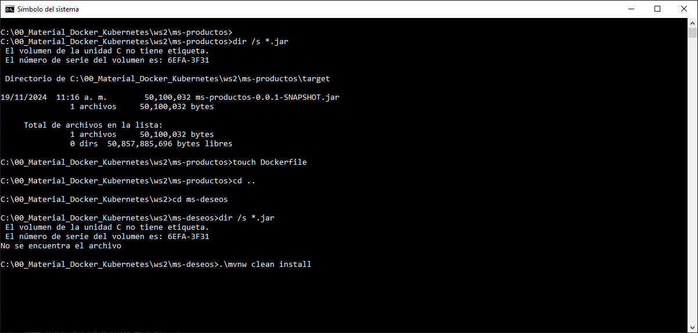
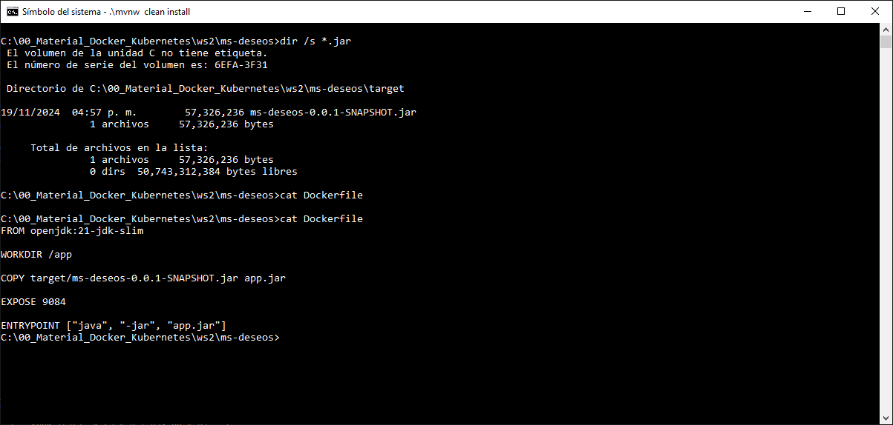
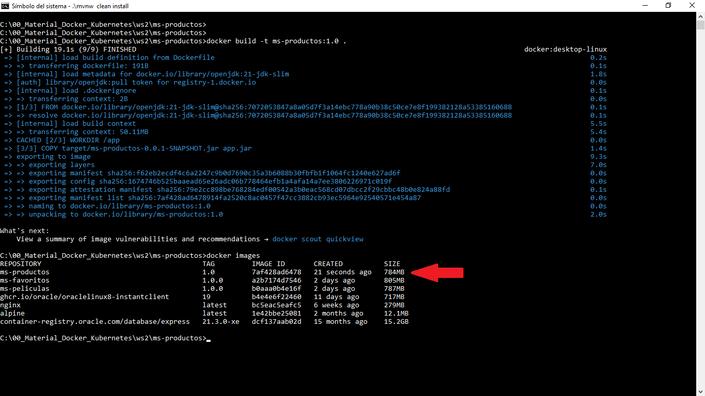
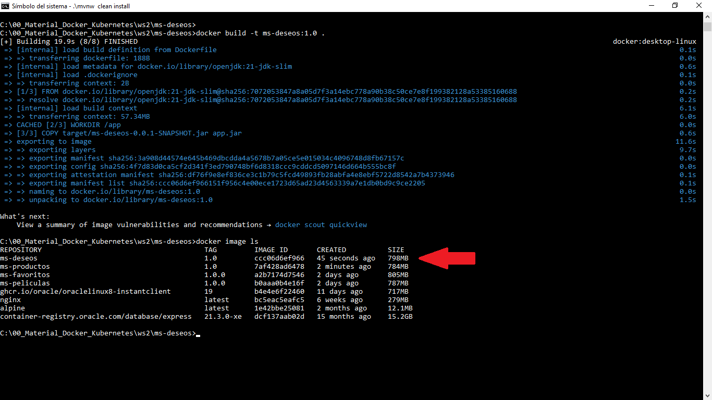
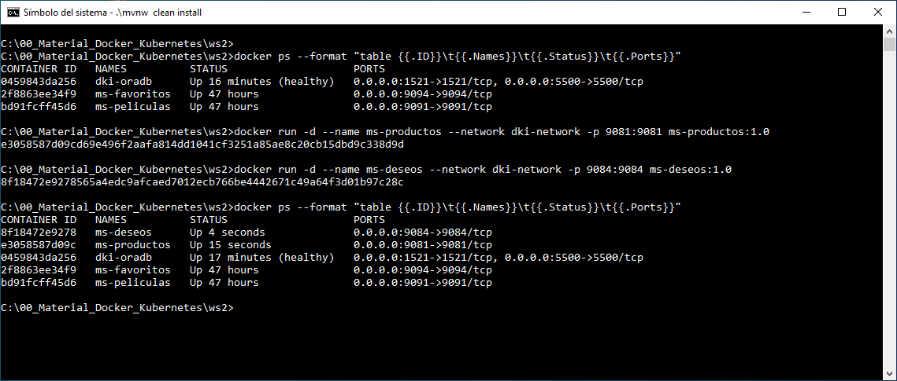
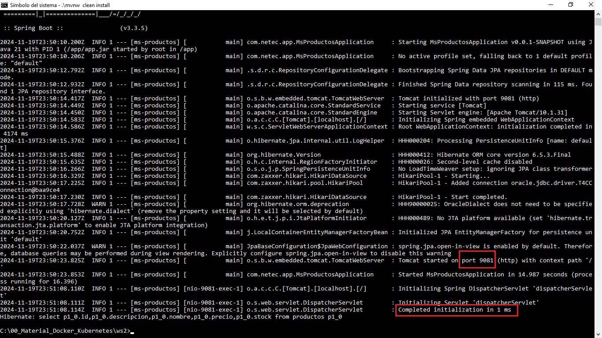
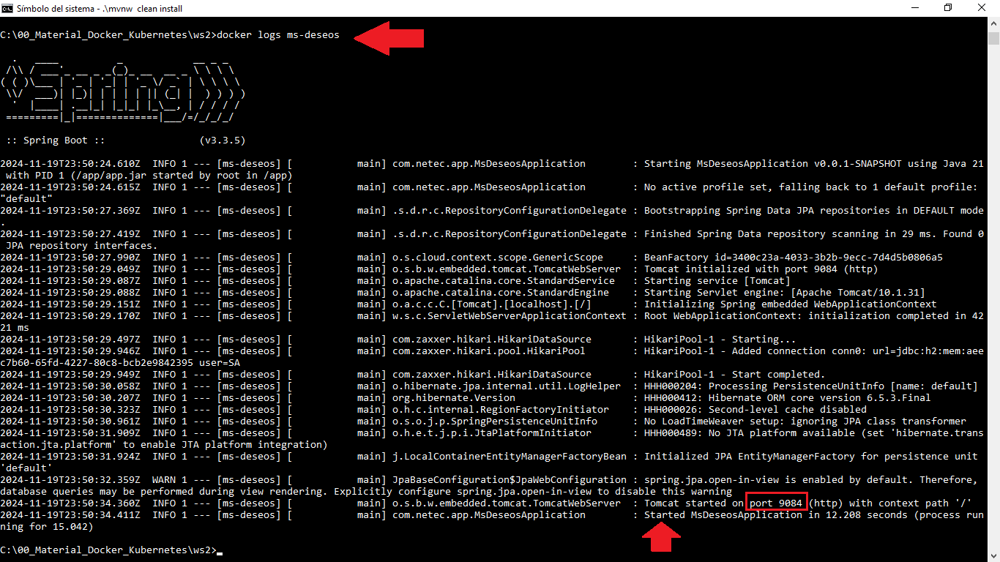
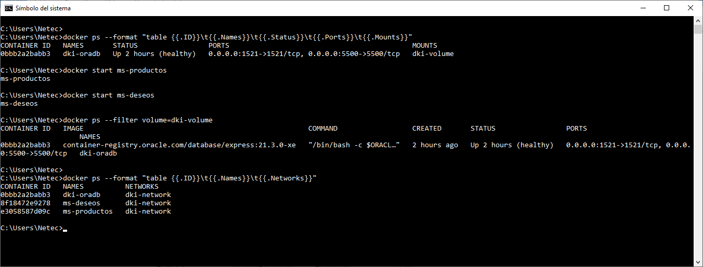

# Práctica 1.6 Contenedores Docker - Caso de Estudio

## Objetivo

Al finalizar esta actividad, serás capaz de crear contenedores Docker para dos microservicios existentes a partir de sus archivos JAR, configurar una red Docker para habilitar la comunicación entre ellos y utilizar la persistencia con Oracle DB mediante volúmenes Docker.

## Duración

25 minutos 

<br/>

## Instrucciones

### Paso 1. Crear Dockerfile para `ms-productos`

1. Navega al directorio/carpeta donde se encuentra el proyecto `ms-productos`.

2. Verifica que tengas el JAR del microservicio

3. Crea un archivo `Dockerfile` con el siguiente contenido:

```Dockerfile
FROM openjdk:21-jdk-slim
WORKDIR /app
COPY target/ms-productos-0.0.1-SNAPSHOT.jar app.jar
EXPOSE 9081
ENTRYPOINT ["java", "-jar", "app.jar"]
```

4. Guarda el archivo.


<br/>

### Paso 2. Crear el Dockerfile para `ms-deseos`

1. Navega al directorio/carpeta donde se encuentra el proyecto `ms-deseos`.

2. Verifica que tengas el JAR del microservicio

3. Crea un archivo `Dockerfile` con el siguiente contenido:

```Dockerfile
FROM openjdk:21-jdk-slim
WORKDIR /app
COPY target/ms-deseos-0.0.1-SNAPSHOT.jar app.jar
EXPOSE 9084
ENTRYPOINT ["java", "-jar", "app.jar"]
```

4. Guarda el archivo.

<br/> 

### Paso 3. Crear las imágenes Docker

1. Abre una terminal de comandos y navega al directorio donde se encuentra el `Dockerfile` del microservicio `ms-productos`.

2. Construye la imagen de ms-productos con el siguiente comando:

```cmd
docker build -t ms-productos:1.0 .

# Verifica la creación de la imagen
docker image ls
```

3. Navega al directorio donde se encuentra el `Dockerfile` del microservicio `ms-deseos`.

4. Construye la imagen de ms-deseos con el siguiente comando:

```cmd
docker build -t ms-deseos:1.0 .

# Verifica la creación de la imagen
docker images
```

<br/>

### Paso 4. Crear y levantar los contenedores

1. Crea el contenedor para `ms-productos` y conéctalo a la red dki-network.

```cmd
docker run -d --name ms-productos --network dki-network -p 9081:9081 ms-productos:1.0
```

2. Crea el contenedro para `ms-deseos` y conéctalo a la red dki-network

```cmd
docker run -d --name ms-deseos --network dki-network -p 9084:9084 ms-deseos:1.0
```

<br/>


### Paso 5. Verificar los contenedores

1. Lista los contenedores en ejecución para confirmar que ambos están activos.

```cmd
docker ps
```

<br/>

### Notas adicionales:

- El contenedor de la base de datos Oracle DB debe estar conectado a la red `dki-network`.

- Asegúrate de que el volumen `dki-volume` esté asociado al contenedor de Oracle DB para la persistencia de datos.

```cmd
docker volume inspect dki-volume

# Muestra los contenedores que tiene el volumen especificado montado.

docker ps --filter volume=dki-volume

```

- Si necesitas revisar los logs de algún contenedor para depuración, usa:

```cmd
docker logs <nombre_del_contenedor>
```

- Con estas instrucciones, los microservicios y la base de datos deberían estar completamente funcionales y listos para las pruebas de la siguiente práctica.

<br/>
<br/>

## Resultado Esperado

- Captura de pantalla que muestra:

    - La verificación de la existencia del JAR para ms-productos.
    - La creación del archivo Dockerfile correspondiente.
    - La verificación de la inexistencia del JAR para ms-deseos, seguida de la instrucción que construye dicho JAR para solucionar la ausencia detectada.



<br/>


- Captua de pantalla que muestra, la verificación del JAR para el microservicio ms-deseos y el contenido del Dockerfile




<br/>

- Captura de pantalla que muestra la construcción y verificación de la imagen Docker `ms-productos`.



<br/>

- Captura de pantalla que muestra la construcción y verificación de la imagen Docker `ms-deseos`.



<br/>

- Captura de pantalla que muestra la creación y verificación de los dos contenedores, `ms-productos` & `ms-deseos`.




<br/>


- Captura de pantalla que muestra la bitácora del microservicio `ms-productos`, en el puerto 9081.



<br/>


- Captura de pantalla que muestra la bitácora del microservicio `ms-deseos`, en el puerto 9084.



<br/>

- Captura de pantalla que muesta algunos reportes y verificaciones adicionales sobre la práctica.



<br/>
