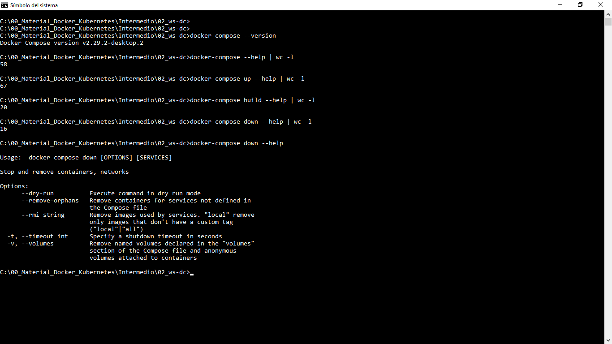

# Práctica 2.1 - Explorando Docker Compose

## Objetivo

Al finalizar esta práctica, serás capaz de analizar y comprender la estructura y función de un archivo docker-compose.yml, identificando sus componentes principales.

## Duración

20 minutos

## Material Necesario

- Docker compose instalado y funcionando.


<br/>

## Instrucciones

### Paso 1. Verifica la instación de Docker Compose

1. Abre una terminal o consola

2. Escribe el comando siguiente:

```cmd
docker-compose --version
```

3. Verifica que se muestre la versión instalada de Docker Compose. Si no está instalado, consulta el material adicional para su instalación.

<br/>

### Paso 2. Familiarízate con Docker Compose

1. Ejecuta el siguiente comando para ver los comandos disponibles en Docker Compose:

```cmd
docker-compose --help
```

2. Observa las opciones y comandos más comunes, como `up`, `down` y `build`.

<br/>

### Paso 3. Analiza el contenido del archivo YAML proporcionado

1. Abre tu editor de texto favorito (VSC o Notepad++)

2. Copia el contenido siguiente a un arhivo docker-compose.yml

```yaml
version: "3.9"
services:
  web:
    container_name: dki-nginx-container  # Nombre del contenedor para el servicio web
    image: nginx:latest
    ports:
      - "8888:80"
    networks:
      - dki-app-network  # Nombre de la red personalizada
  db:
    container_name: dki-mysql-container  # Nombre del contenedor para el servicio de base de datos
    image: mysql:5.7
    environment:
      MYSQL_ROOT_PASSWORD: Netec_123
      MYSQL_DATABASE: dki-database
    volumes:
      - dki-db-volume:/var/lib/mysql  # Nombre del volumen personalizado
    networks:
      - dki-app-network  # Nombre de la red personalizada

volumes:
  dki-db-volume:  # Volumen personalizado para almacenar los datos de MySQL

networks:
  dki-app-network:  # Red personalizada para conectar los servicios

```

3. Identifica y comprende las secciones principales

- **version**: Especifica la versión de Docker Compose utilizada

- **services**: Lista los contenedores definidos:

    - Servicio `web` que usa la imagen `nginx:latest` y expone el puerto `8888`.

    - Servicio `db` que usa la imagen `mysql:5.7` y configura un volumen y variables de entorno.

- **volumes**: Define un volumen persistente llamado `dki-db-volume`.

- **networks**: Configura una red para que los servicios se comuniquen entre sí.

- Recuerda que es importante mantener la indentación correcta en cada nivel.

<br/>

### Paso 4. Reflexiona y responde las siguiente preguntas

1. ¿Qué servicios están definidos en el archivo?

2. ¿Cómo se configuran los puertos para el servicio `web`?

3. ¿Qué variables de entorno se establecen para el servicio `db`?

4. ¿Qué función cumple el volumen `dki-db-volume`?

5. ¿Por qué es importante la red `dki-app-network` en esta configuración?

<br/>

### Paso 5. Ejecuta el Archivo Docker Compose

1. Abre una terminal en la misma carpeta donde se encuentra el archivo docker-compose.yml.

2. Ejecuta el siguiente comando para iniciar los servicios:

```cmd 
docker-compose up -d
```

3. Verifica que los servicios estén corriendo usando:

```cmd  
docker ps
docker volume ls
docker network ls
docker network inspect dki-app-network
docker logs dki-mysql-container
```

4. Conéctate al servidor de base MySQL y verifica que la base de datos `dki-database` existe y no tienen ninguna tabla.

```cmd
docker exec -it dki-mysql-container bash
```

```bash
mysql -uroot -proot -hdb
```

```sql
show databases;
use dki-database
show tables;
```


5. Con el navegador de tu preferencia verifica el servidor NGINX funciona correctamente.


6. Detén los servicios y elimina los contenedores con:
 
```cmd 
docker-compose down
```

7. Verifica los contenedores, volumenes, y red se eliminaron

```cmd
docker ps
docker ps -a
docker volume ls
docker network ls
```


<br/>
<br/>

## Resultado Esperado

- La siguente captura de pantalla muestra  




<br/>
