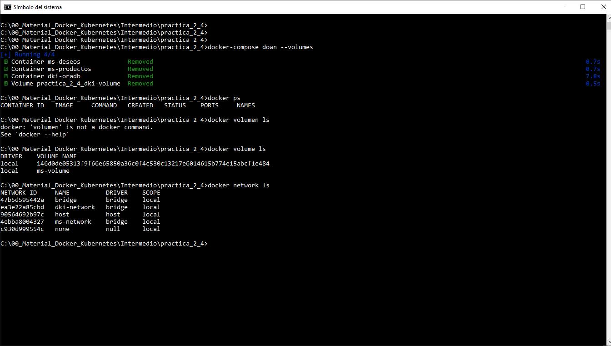

# 2.4 Integración de Microservicios en Docker Compose

## Objetivo

Al finalizar esta práctica, serás capaz de añadir los microservicios del caso de estudio al archivo `docker-compose.yml`, conectándolos a la base de datos Oracle y definiendo redes para la comunicación entre ellos

<br/>

## Objetivo Visual



<br/>

## Solicitudes HTTP


<br/>

## Duración

40 minutos


<br/>

## Instrucciones

### 1. Verificar contenedores existentes

- Verifica los contenedores que actualmente tienes configurados

```cmd
docker ps
docker ps -a
```

- Elimina los contenedores ms-productos, ms-deseos y oracle-db si es que existen.

```cmd
docker rm -f ms-productos ms-deseos oracle-db
```

### 2. Crear la carpeta de trabajo para esta práctica

- Abre una terminal o consola y navega al directorio de las prácticas del curso.

- Crea una nueva carpeta llamada practica_2_4 y copia el archivo `docker-compose.yml` desde la carpeta practica_2_3.  


```cmd
mkdir practica_2_4
cp practica_2_3\docker-compose.yml practica_2_4
cd practica_2_4
```


- **Nota**: También puedes ir al README2_3 y copiar el contenido del `docker-compose.yml` de la práctica_2_3.

<br/>


### 3. Crear la estructura para los scripts de Oracle

- Crea una carpeta local llamada `scripts` en el mismo directorio donde está el archivo ```docker-compose.yml``` y coloca ahí el archivo ```init_schema.sql```:

```cmd
mkdir scripts
cd scripts
touch init_schema.sql
code init_schema.sql
```

<br/>


### 4. Crear Scripts de Oracle para inicialización.
Configura un usuario llamado `dkuser` con la contraseña `dkpassword` en la base de datos. Asegúrate de otorgarle los permisos necesarios para:

- Establecer conexiones a la base de datos.

- Crear tablas dentro de su esquema.

- Insertar y modificar registros en las tablas.

- Utilizar espacio en el tablespace asignado.


```sql
-- Cambiamos de sesión
ALTER SESSION SET CONTAINER = XEPDB1;

-- Crear un esquema y asignar permisos
CREATE USER dkuser IDENTIFIED BY dkpassword;
GRANT CONNECT, RESOURCE TO dkuser;

-- Espacio ilimitado en el tablespace users.
ALTER USER dkuser QUOTA UNLIMITED ON users;

```

<br/>


### 5. Actualizar el archivo docker-compose.yml para incluir los microservicios:

- Añade los servicios `ms-productos` y `ms-deseos` al archivo. Asegúrate de que cada servicio esté conectado a la red `dki-network` y que utilicen variables de entorno para la conexión con la base de datos Oracle.

```yaml
version: "3.9"

services:
  dki-oracle-db:
    container_name: oracle-db   
    image: container-registry.oracle.com/database/express:21.3.0-xe   
    environment:
      ORACLE_PWD: Netec_123 
      ORACLE_SID: XE
      ORACLE_PDB: XEPDB1
      ORACLE_CHARACTERSET: AL32UTF8
    ports:
      - "1521:1521"  
      - "5500:5500"   
    volumes:
      - dki-oracle-data:/opt/oracle/oradata   
      - ./scripts:/opt/oracle/scripts/startup  # Montar el directorio de scripts
    networks:
      - dki-network   
volumes:
  dki-oracle-data:   
networks:
  dki-network:   
     driver: bridge

  ms-productos:
    image: ms-productos:1.0
    container_name: ms-productos
    ports:
      - "9081:9081"
    environment:
      USER_DEMO : Netec
    networks:
      - dki-network
    depends_on:
      - oracle-db

  ms-deseos:
    image: ms-deseos:1.0
    container_name: ms-deseos
    ports:
      - "9084:9084"
    environment:
      MS_PRODUCTOS_URL: http://ms-productos:9081/api/productos
    networks:
      - dki-network
    depends_on:
      - ms-productos

networks:
  dki-network:
    driver: bridge

```

- Guarda los cambios en el archivo `docker-compose.yml`

<br/>

### 6. Levantar los contenedores con Docker Compose

- Ejecuta el siguiente comando para verificar tu configuración

```cmd
docker-compose config
```

- Ejecuta el siguiente comando para desplegar los contenedores

```cmd
docker-compose up -d
```
<br/>

### 7. Verificar que los contenedores están funcionando correctamente:

- Usa el comando `docker ps` para listar los contenedores en ejecución.

```cmd
docker ps
docker image ls
docker volume ls
docker network ls
```

### 8. Probar la conexión entre los servicios:

- Usa una herramienta como Postman o curl para enviar solicitudes a `ms-productos` en el puerto 9081 y a `ms-deseos` en el puerto 9084.

Ejemplo para verificar `ms-productos`:

```cmd
curl http://localhost:9081/api/productos
```

Ejemplo para verificar ms-deseos:

```cmd
curl http://localhost:9084/api/deseos
```


**Nota**:
- Recuerda que la primera vez que usas los microservicios no se tiene información.


### 9. Detener los contenedores:

- Cuando termines, detén y elimina los contenedores ejecutando:

```cmd
docker-compose down --volumes
```

<br/>
<br/>

## Resultado Esperado:

Los microservicios `ms-productos` y `ms-deseos` deben estar funcionando correctamente, conectados entre sí y a la base de datos Oracle, a través de la red `dki-network`.