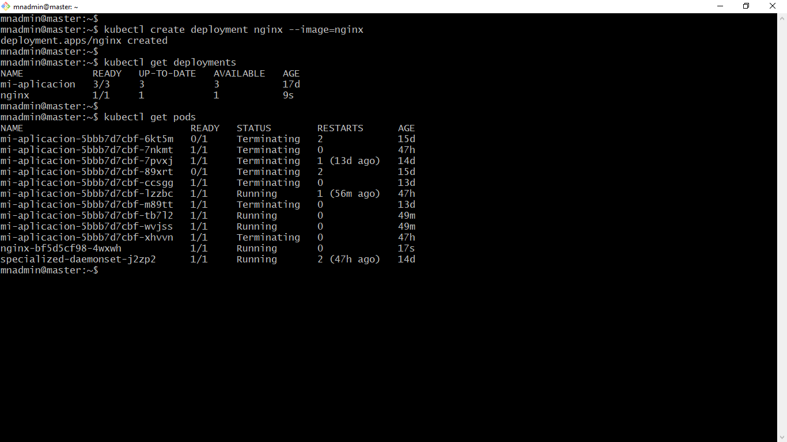

# Práctica 3.1 Verificación del Clúster

## Objetivo

Al finalizar esta práctica, serás capaz de realizar una validación completa de un clúster de Kubernetes para asegurar que está configurado correctamente y es funcional, comprobando que puede gestionar recursos esenciales como Deployments, ConfigMaps y Servicios.

## Duración

30 minutos

<br/>

## Instrucciones

### 1. Verificar que los nodos estén listos

Ejecuta el comando:

```bash
kubectl get nodes
```

Asegúrate de que todos los nodos están en estado `Ready`.

<br/>

### 2. Validar que los componentes del clúster estén funcionando

Ejecuta el comando:

```bash
kubectl get pods -n kube-system
```

Verifica que los Pods en el espacio de nombres `kube-system` están en estado Running o Completed, especialmente:

- kube-apiserver
- kube-controller-manager
- kube-scheduler
- etcd
 

<br/>

### 3. Crear y probar un Deployment

Crea un Deployment mínimo como prueba:

```bash
kubectl create deployment nginx --image=nginx
```

Verifica que el Deployment se creó correctamente:

```bash
kubectl get deployments
kubectl get pods
```

Asegúrate de que el Pod asociado al Deployment está en estado Running.

<br/>

### 4. Probar ConfigMaps

Crea un ConfigMap de prueba:

```bash
kubectl create configmap test-config --from-literal=key1=value1
```

Verifica que el ConfigMap fue creado:

```bash
kubectl get configmaps
kubectl describe configmap test-config
```

<br/>

### 5. Probar Servicios

Crea un servicio expuesto en ClusterIP para el Deployment de nginx:

```bash
kubectl expose deployment nginx --port=80 --target-port=80
```

Verifica el servicio:

```bash
kubectl get services
```

Opcionalmente, prueba el acceso al servicio dentro del clúster usando `kubectl` exec en un Pod.

<br/>

### 6. Verificar que los recursos están funcionando juntos

Prueba acceder al Deployment usando el servicio creado:

```bash
kubectl run curl-test --image=curlimages/curl -it --rm -- curl nginx
```

Esto debería devolver una respuesta válida del servidor Nginx.


<br/>

### 7. Verificar logs en caso de problemas

Si encuentras errores, inspecciona los eventos y logs:

```bash
 
kubectl describe pod <nombre-del-pod>

kubectl logs <nombre-del-pod>
```

<br/>

### 8. Verifica los objetos Kubenetes asociados a Oracle Database

Para asegurar que Oracle Database está correctamente desplegada en un clúster de Kubernetes, debes verificar los siguientes objetos de Kubernetes relacionados:

#### 1. **Pods**
   - Verifica que el Pod (o Pods) de Oracle Database esté corriendo.

   ```bash
   kubectl get pods 
   ```
   
   - Si no hay un namespace asociados pudes no usar -n <namespace>, en este y los demás comandos.
   - Si el Pod no está funcionando, utiliza el comando `kubectl describe pod <pod-name> -n <namespace>` o `kubectl logs <pod-name> -n <namespace>` para diagnosticar problemas.


#### 2. **Services**
   - Comprueba que haya un **Service** configurado para exponer Oracle Database (por ejemplo, `ClusterIP`, `NodePort` o `LoadBalancer`).
   
   ```bash
   kubectl get services  
   ```
   - Verifica que los puertos expuestos sean correctos para Oracle DB, como el puerto 1521 por defecto.


#### 3. **PersistentVolume (PV) y PersistentVolumeClaim (PVC)**
   - Verifica que los **PersistentVolumes** y **PersistentVolumeClaims** estén correctamente ligados y en estado "Bound".

   ```bash
   kubectl get pv
   kubectl get pvc  
   ```

#### 4. **ConfigMap**
   - Si configuraste Oracle DB con un **ConfigMap** para gestionar parámetros de configuración, asegúrate de que exista y que esté correctamente referenciado por los Pods.
   
   ```bash
   kubectl get configmap  
   ```

#### 5. **Logs**
   - Verifica los logs del Pod para identificar cualquier error durante el inicio o ejecución.

   ```bash
   kubectl logs <pod-name>  
   ```
   

### 6. **Docker Image**
   - Comprueba que la imagen de Docker utilizada para Oracle DB sea correcta y compatible con Kubernetes, recuerda que en el ambiente proporcionado usas containerd, en lugar de Docker.

   - Conectate con ssh a tu nodo worker y aplica el siguiente comando

  ```bash
   sudo crictl images 2>/dev/null | grep -i oracle

   sudo crictl ps 2>/dev/null | grep  -i oracle
   ```

    - **Nota**: Veras la imagen de Oracle Database 21.3.0-xe y el contenedor oracle-db en estado de Running.


<br/>

### 9. Instrucciones para Verificar Conexiones a Oracle usando SQL Developer

#### Requisitos Previos:
1. **SQL Developer instalado:** Asegúrate de tener instalado Oracle SQL Developer en tu máquina Windows.

2. **Datos de conexión:** Verifica que tienes la siguiente información:
   - **Usuario 1:** `dkuser`
     - Contraseña: `dkpassword`

   - **Usuario 2:** `sys`
     - Contraseña: `dkpasswords`
     - Tipo de autenticación: **SYSDBA**

   - **Hostname**: Dirección IP o nombre de tu servidor Oracle.

   - **Servicio**: `XEPDB1`.

   - **Puerto**: `1521`.


#### Paso 1. Iniciar SQL Developer
1. Abre SQL Developer.

    - Verifica si ya tienes las conexiciones hacia la base de datos Oracle, en caso contrario, agregada dos conexiones una para el usuario dkuser y otra para sys con el rol de dba.

2. Haz clic en el botón de conexión **+** para crear una nueva conexión.

<br/>

#### Paso 2: Configurar la Conexión para el Usuario `dkuser`

1. En la ventana de conexión, proporciona los siguientes detalles:
   - **Nombre de la conexión:** `dkuser-xepdb1`
   - **Usuario:** `dkuser`
   - **Contraseña:** `dkpassword`
   - **Hostname:** <Dirección IP o nombre del servidor>.
   - **Puerto:** `<puerto expuesto por servicio de Kubernetes>`
   - **SID/Servicio:** `XEPDB1` (elige "Servicio" en el tipo de conexión).

2. Haz clic en **Probar conexión**.

3. Si la conexión es exitosa, guarda los detalles haciendo clic en **Conectar**.

<br/>

#### Paso 3: Configurar la Conexión para el Usuario `sys`

1. Crea una nueva conexión similar a la anterior con los siguientes detalles:
   - **Nombre de la conexión:** `dki-sys`
   - **Usuario:** `sys`
   - **Contraseña:** `dkpassword`
   - **Hostname:** <Dirección IP o nombre del servidor>
   - **Puerto:** `<puerto expuesto por servicio de Kubernetes>`
   - **SID/Servicio:** `XE`
   - **Rol:** Selecciona **SYSDBA**.

2. Haz clic en **Probar conexión**.

3. Si la conexión es exitosa, guarda los detalles haciendo clic en **Conectar**.

<br/>

#### Verificaciones SQL para el Usuario `dkuser`

Conecta a la base de datos usando la conexión `dkuser` y realiza las siguientes operaciones para verificar las capacidades del usuario.

##### 1. **Conexión a la Base de Datos**
Ejecuta el siguiente comando para asegurarte de que estás conectado:

```sql
SELECT SYS_CONTEXT('USERENV', 'SESSION_USER') AS CURRENT_USER FROM DUAL;
```
- El resultado debe mostrar `dkuser`.

<br/>

##### 2. **Crear una Tabla**

Crea una tabla llamada `TEST_TABLE`:

```sql
CREATE TABLE TEST_TABLE (
    ID NUMBER PRIMARY KEY,
    NAME VARCHAR2(100)
);
```

<br/>


##### 3. **Insertar un Registro**

Inserta un registro en la tabla:

```sql
INSERT INTO TEST_TABLE (ID, NAME) VALUES (1, 'Test User');
COMMIT;
```

<br/>

##### 4. **Realizar una Búsqueda**

Realiza una consulta para verificar que el registro fue insertado:

```sql
SELECT * FROM TEST_TABLE;
```

---

##### 5. **Eliminar la Tabla**

Elimina la tabla para limpiar el entorno:

```sql
DROP TABLE TEST_TABLE;
```

<br/>

Estas instrucciones te ayudarán a verificar que el usuario `dkuser` puede realizar operaciones básicas en la base de datos `XEPDB1` utilizando SQL Developer y comandos SQL, y que tus servicios podrán gestionar su persistencia de datos.


<br/> 
<br/>

## Resultado Esperado


- Captura de pantalla que muestra la versión de `kubectl`, el estado de los nodos en el clúster de Kubernetes, y el estado de los Pods en el namespace kube-system.


<br/>

- Captura de pantalla que ilustra cómo, utilizando un enfoque imperativo, se crea un Deployment con la última versión de la imagen de Nginx, seguido de la visualización del estado del Deployment y de los Pods asociados a dicho Deployment.



<br/>

- Captura de pantalla que muestra cómo, mediante un enfoque imperativo, se crea un ConfigMap, seguido de la verificación de los ConfigMaps existentes y la descripción detallada del ConfigMap, en la cual se puede observar el valor en texto plano de la clave `key1`.


<br/>

- Captura de pantalla que muestra el proceso para exponer un servicio en Kubernetes, seguido de la salida del comando kubectl get services para listar los servicios creados, y finalmente el uso del comando kubectl run curl-test... para realizar una solicitud HTTP al servidor Nginx, evidenciado por la respuesta en formato HTML proporcionada por el servidor.


**Nota**: El comando `kubectl run curl-test --image=curlimages/curl -it --rm -- curl nginx` se utiliza para ejecutar un contenedor temporal basado en la imagen `curlimages/curl` y realizar una solicitud HTTP al servicio nginx.

<br/>


- Captura de pantalla que muestra el estado de los Pods y un fragmento de la descripción del Pod asociado al Deployment de Nginx.


<br/>

- Captura de pantalla que muestra la bitácora del Pod asociado al Deployment de Nginx, donde se observa en la última línea la solicitud enviada como parte de la práctica utilizando un contenedor temporal de prueba.


 
<br/>

- Captura de pantalla que muestra la instancia de Oracle Database está desplegada correctamente en el clúster de Kubernetes:

    - El Pod está corriendo sin problemas.
    - El servicio está configurado y accesible a través del puerto `30011`.
    - El almacenamiento persistente está enlazado correctamente con un PVC y un PV.
    - Los ConfigMaps y Secrets están disponibles para la configuración y credenciales de la base de datos.
    - Los logs confirman que la instancia está operativa y funcional.

Esto indica que todos los recursos necesarios para el funcionamiento de Oracle Database en Kubernetes están configurados y operativos.


 <br/>

- Captura de pantalla que muestra la configuración de una conexión en SQL Developer para el usuario `dkuser`, utilizando el servicio `XEPDB1`, alojado en el host `192.168.0.79` y el puerto `30011`. El estado de la conexión confirma que está configurada correctamente y es funcional. Es importante tener en cuenta que tanto la dirección IP como el puerto pueden variar, aunque en un entorno Kubernetes, el puerto generalmente estará dentro del rango de los treinta mil.


 <br/>

- Captura de pantalla muestra la configuración de una conexión en SQL Developer para el usuario sys, con rol de SYSDBA, en una base de datos Oracle. Es importante destacar que tanto la dirección IP como el puerto pueden variar dependiendo de la configuración del clúster o entorno en el que esté desplegado Oracle. En Kubernetes, el puerto típicamente estará dentro del rango de los treinta


<br/>

- La captura de pantalla muestra la ejecución exitosa de comandos SQL en Oracle SQL Developer, conectados con el usuario dkuser en el servicio XEPDB1

