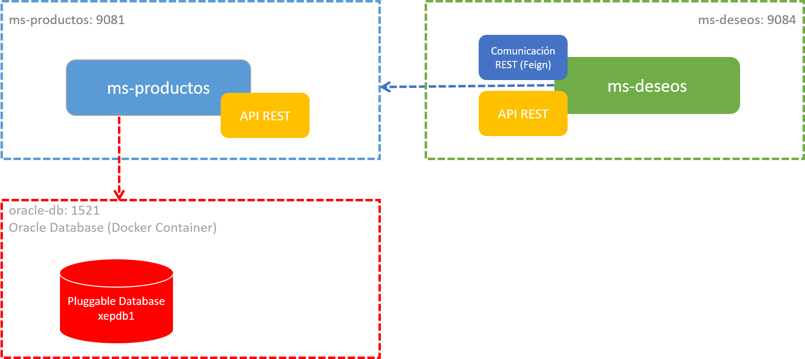

# Práctica 3.2 Customización de Propiedades

## Objetivo

Al finalizar esta práctica, serás capaz de retomar los microservicios desarrollados anteriormente, ajustando su configuración mediante la definición de propiedades en archivos `application.properties` y variables de ambiente para su despliegue en un entorno basado en contenedores.

## Duración

25 minutos

## Objetivo Visual

 

## Instrucciones