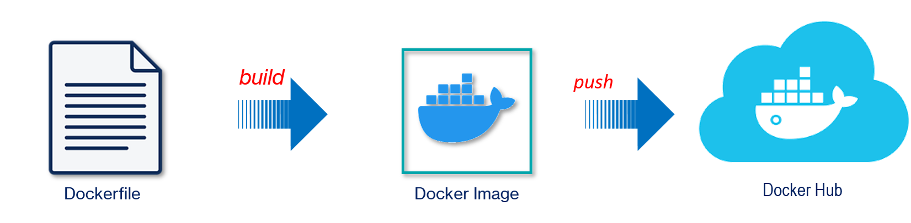

# Práctica 3.3 Docker Registry

## Objetivo

- Al finalizar esta práctica, serás capaz de crear una imagen Docker a partir del código de los microservicios y publicarla en Docker Hub, utilizando buenas prácticas para el etiquetado y manejo de versiones.

<br/>

## Objetivo Visual



<br/>

## Duración

25 minutos

<br/>


### Práctica 3.3 Docker Registry

#### Objetivo
- Al finalizar esta práctica, serás capaz de crear una imagen Docker a partir del código de los microservicios y publicarla en Docker Hub, utilizando buenas prácticas para el etiquetado y manejo de versiones.


<br/>

### Instrucciones

#### **1. Verificar el estado del Docker Daemon**
Asegúrate de que Docker esté ejecutándose en tu máquina de desarrollo Windows, en el entorno de curso.

```bash
docker info
```
Si Docker está corriendo correctamente, verás información del sistema. Si no, inicia Docker.

<br/>

#### **2. Construir la imagen del microservicio**

1. Accede al directorio de cada microservicio (por ejemplo, `ms-productos`).

   ```bash
   cd /ruta/a/ms-productos
   ```
   
<br/>

2. Construye la imagen Docker desde el archivo `Dockerfile`:

   ```bash
   docker build -t ms-productos:1.0 .

   ```
   **Salida esperada:**
   ```
   Successfully built <IMAGE_ID>
   Successfully tagged ms-productos:1.0
   ```

<br/>

3. Repite el proceso para el segundo microservicio (`ms-deseos`):

   ```bash
   cd /ruta/a/ms-deseos
   docker build -t ms-deseos:1.0 .
   ```

<br/>

#### **3. Verificar las imágenes construidas**

Lista las imágenes locales para confirmar que las imágenes han sido creadas correctamente:

```bash
docker images
```

**Salida esperada:**
```
REPOSITORY       TAG       IMAGE ID       CREATED          SIZE
ms-productos     1.0       <IMAGE_ID>     X seconds ago    X MB
ms-deseos        1.0       <IMAGE_ID>     X seconds ago    X MB
```

<br/>


#### **4. Iniciar sesión en Docker Hub**

Inicia sesión con tu cuenta de Docker Hub:
```bash
docker login
```

Ingresa tu nombre de usuario y contraseña de Docker Hub cuando se solicite. Si la autenticación es exitosa:

```
Login Succeeded
```

<br/>

#### **5. Etiquetar las imágenes para Docker Hub**

Asigna etiquetas a las imágenes con el formato adecuado para Docker Hub. Reemplaza `TU_USUARIO` por tu nombre de usuario en Docker Hub.

1. Para `ms-productos`:

   ```bash
   docker tag ms-productos:1.0 TU_USUARIO/ms-productos:1.0
   ```

2. Para `ms-deseos`:

   ```bash
   docker tag ms-deseos:1.0 TU_USUARIO/ms-deseos:1.0
   ```

<br/>

#### **6. Publicar las imágenes en Docker Hub**

Sube las imágenes al Docker Registry:

1. Para `ms-productos`:

   ```bash
   docker push TU_USUARIO/ms-productos:1.0
   ```

   **Salida esperada:**
   ```
   The push refers to repository [docker.io/TU_USUARIO/ms-productos]
   X.X MB [==================================================] 100%
   latest: digest: sha256:<DIGEST_ID> size: X
   ```

2. Para `ms-deseos`:

   ```bash
   docker push TU_USUARIO/ms-deseos:1.0
   ```
   **Salida esperada:**
   ```
   The push refers to repository [docker.io/TU_USUARIO/ms-deseos]
   X.X MB [==================================================] 100%
   latest: digest: sha256:<DIGEST_ID> size: X
   ```

<br/>

#### **7. Verificar las imágenes en Docker Hub**

Utiliza el comando `docker search` para buscar tus imágenes en Docker Hub:

1. Para `ms-productos`:
   ```bash
   docker search TU_USUARIO/ms-productos
   ```

   **Salida esperada:**

   ```
   NAME                         DESCRIPTION   STARS   OFFICIAL   AUTOMATED
   TU_USUARIO/ms-productos      ...           0
   ```

2. Para `ms-deseos`:

   ```bash
   docker search TU_USUARIO/ms-deseos
   ```

   **Salida esperada:**

   ```
   NAME                         DESCRIPTION   STARS   OFFICIAL   AUTOMATED
   TU_USUARIO/ms-deseos         ...           0
   ```

<br/>

### Recomendadiones

1. Utiliza etiquetas descriptivas y versiones en las imágenes (`:1.0`, `:1.1`, `:latest`).

2. Repite el proceso para cada versión nueva del microservicio, asegurándote de incrementar las versiones de las etiquetas.

3. Documenta los pasos realizados y los comandos utilizados en un archivo `README` en los repositorios de los microservicios.


### Referencias

- Este es el sitio oficial que define las reglas y especificaciones del versionado semántico. Ofrece una guía detallada sobre cómo asignar e incrementar los números de versión de manera coherente.

    [Versionado Semático](https://semver.org/lang/es/)

<br/>

- Este artículo aborda la implementación del versionado semántico en arquitecturas de microservicios, destacando su importancia para la gestión de dependencias y la compatibilidad entre servicios.

    [Mejores Prácticas de Versionado Semático para Microservicios](https://peerdh.com/es/blogs/programming-insights/semantic-versioning-best-practices-for-microservices)


<br/>
<br/>

## Resultado Esperado

- Captura de pantalla que muestra si Docker esta corriendo correctamente

