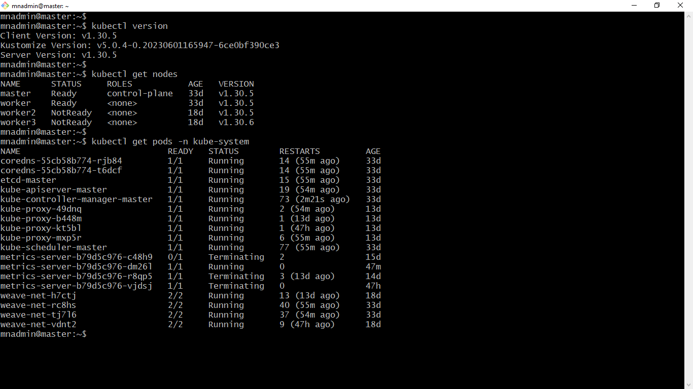
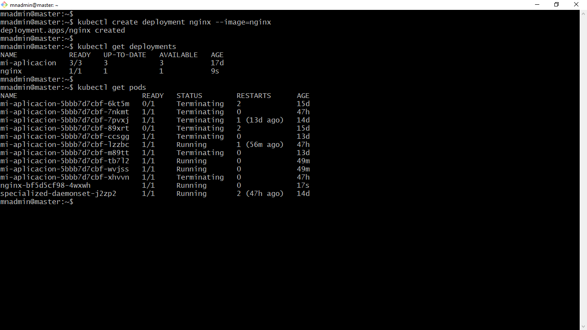
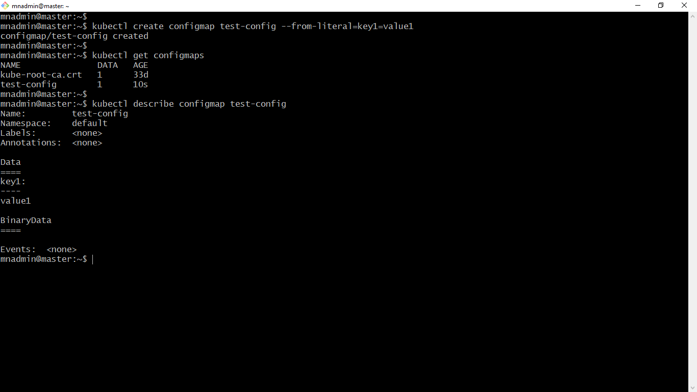
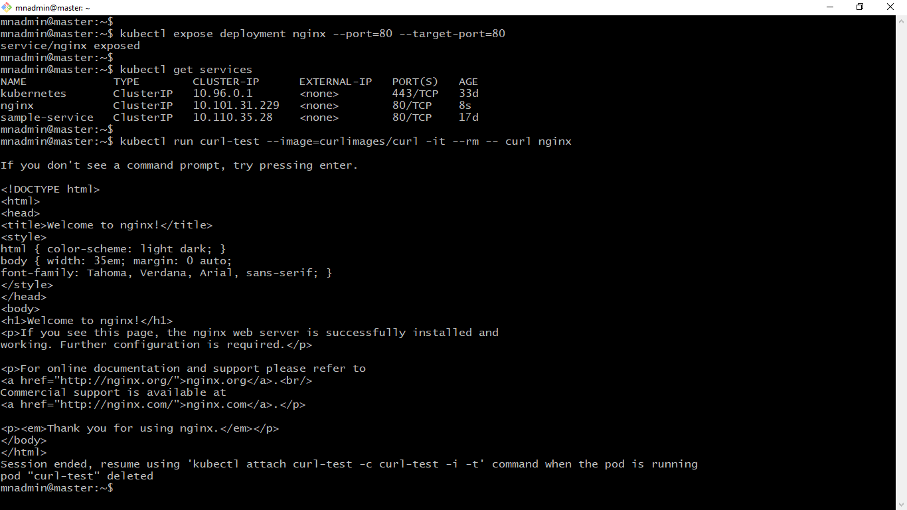
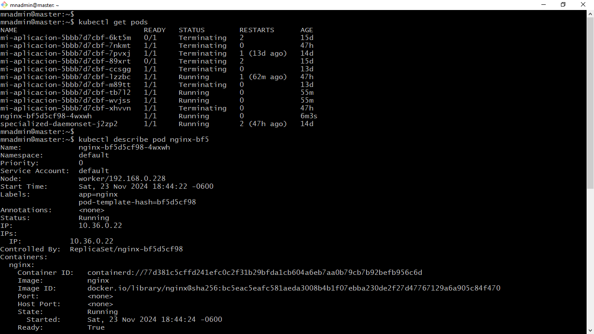
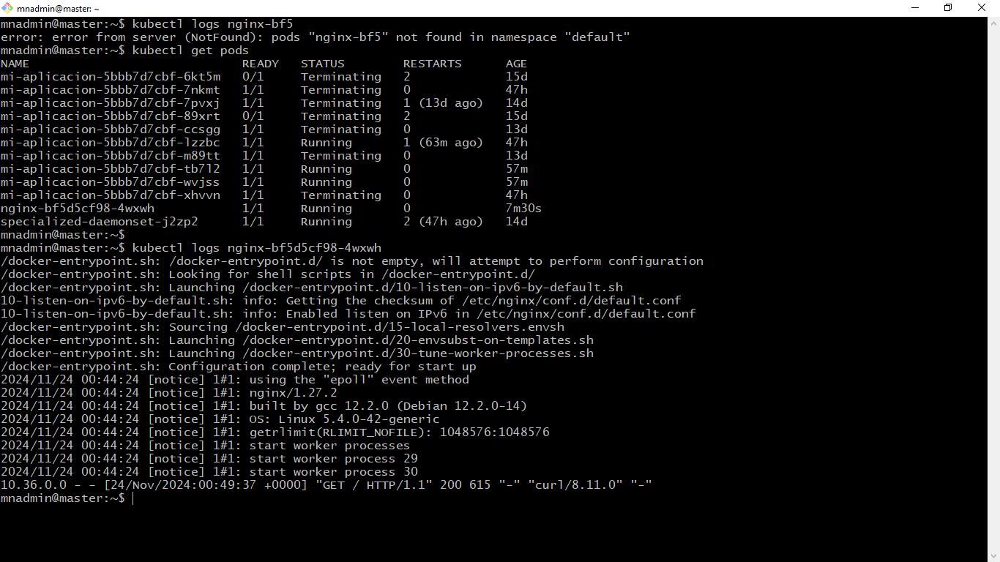

# Práctica 3.1 Verificación del Clúster

## Objetivo

Al finalizar esta práctica, serás capaz de realizar una validación completa de un clúster de Kubernetes para asegurar que está configurado correctamente y es funcional, comprobando que puede gestionar recursos esenciales como Deployments, ConfigMaps y Servicios.

## Duración

25 minutos

<br/>

## Instrucciones

### 1. Verificar que los nodos estén listos

Ejecuta el comando:

```bash
kubectl get nodes
```

Asegúrate de que todos los nodos están en estado `Ready`.

<br/>

### 2. Validar que los componentes del clúster estén funcionando

Ejecuta el comando:

```bash
kubectl get pods -n kube-system
```

Verifica que los Pods en el espacio de nombres `kube-system` están en estado Running o Completed, especialmente:

- kube-apiserver
- kube-controller-manager
- kube-scheduler
- etcd
 

<br/>

### 3. Crear y probar un Deployment

Crea un Deployment mínimo como prueba:

```bash
kubectl create deployment nginx --image=nginx
```

Verifica que el Deployment se creó correctamente:

```bash
kubectl get deployments
kubectl get pods
```

Asegúrate de que el Pod asociado al Deployment está en estado Running.

<br/>

### 4. Probar ConfigMaps

Crea un ConfigMap de prueba:

```bash
kubectl create configmap test-config --from-literal=key1=value1
```

Verifica que el ConfigMap fue creado:

```bash
kubectl get configmaps
kubectl describe configmap test-config
```

<br/>

### 5. Probar Servicios

Crea un servicio expuesto en ClusterIP para el Deployment de nginx:

```bash
kubectl expose deployment nginx --port=80 --target-port=80
```

Verifica el servicio:

```bash
kubectl get services
```

Opcionalmente, prueba el acceso al servicio dentro del clúster usando `kubectl` exec en un Pod.

<br/>

### 6. Verificar que los recursos están funcionando juntos

Prueba acceder al Deployment usando el servicio creado:

```bash
kubectl run curl-test --image=curlimages/curl -it --rm -- curl nginx
```

Esto debería devolver una respuesta válida del servidor Nginx.


<br/>

### 7. Verificar logs en caso de problemas

Si encuentras errores, inspecciona los eventos y logs:

```bash
 
kubectl describe pod <nombre-del-pod>

kubectl logs <nombre-del-pod>
```


<br/> 
<br/>

## Resultado Esperado


- Captura de pantalla que muestra la versión de `kubectl`, el estado de los nodos en el clúster de Kubernetes, y el estado de los Pods en el namespace kube-system.




<br/>

- Captura de pantalla que ilustra cómo, utilizando un enfoque imperativo, se crea un Deployment con la última versión de la imagen de Nginx, seguido de la visualización del estado del Deployment y de los Pods asociados a dicho Deployment.



<br/>

- Captura de pantalla que muestra cómo, mediante un enfoque imperativo, se crea un ConfigMap, seguido de la verificación de los ConfigMaps existentes y la descripción detallada del ConfigMap, en la cual se puede observar el valor en texto plano de la clave `key1`.



<br/>

- Captura de pantalla que muestra el proceso para exponer un servicio en Kubernetes, seguido de la salida del comando kubectl get services para listar los servicios creados, y finalmente el uso del comando kubectl run curl-test... para realizar una solicitud HTTP al servidor Nginx, evidenciado por la respuesta en formato HTML proporcionada por el servidor.



**Nota**: El comando `kubectl run curl-test --image=curlimages/curl -it --rm -- curl nginx` se utiliza para ejecutar un contenedor temporal basado en la imagen `curlimages/curl` y realizar una solicitud HTTP al servicio nginx.

<br/>


- Captura de pantalla que muestra el estado de los Pods y un fragmento de la descripción del Pod asociado al Deployment de Nginx.



<br/>

- Captura de pantalla que muestra la bitácora del Pod asociado al Deployment de Nginx, donde se observa en la última línea la solicitud enviada como parte de la práctica utilizando un contenedor temporal de prueba.



 