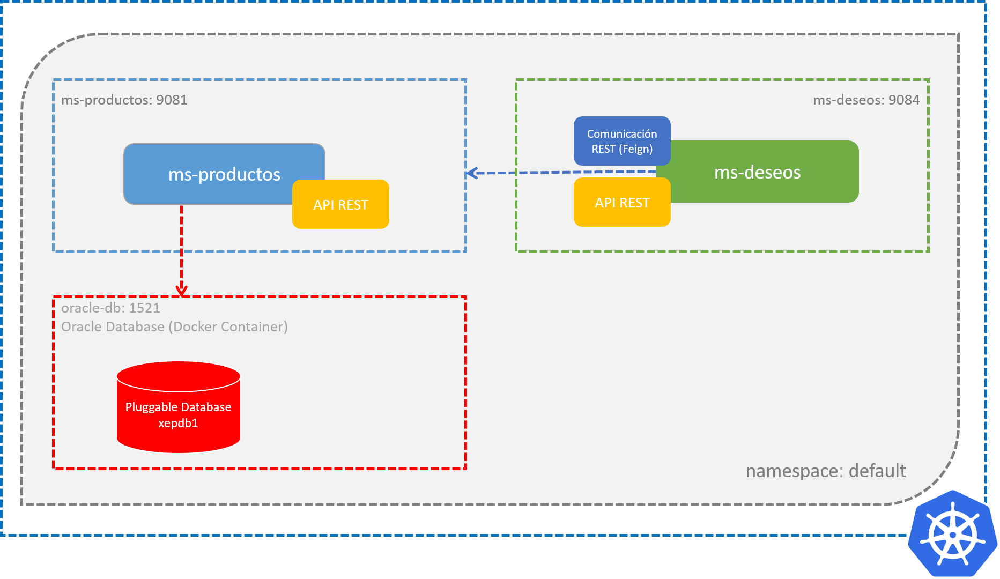

# Práctica 4.1 Spring Cloud Kubernetes

## Objetivo

- Al finalizar esta práctica, serás capaz de integrar y aplicar todos los conocimientos adquiridos en la unidad 4 para configurar, desplegar y probar microservicios Spring Boot en un clúster de Kubernetes, utilizando Spring Cloud Kubernetes, ConfigMaps, configuración de entornos, probes de liveness y readiness, y ajustes de recursos para contenedores, validando la implementación mediante herramientas como Postman y observando el comportamiento del LoadBalancer y metadata de los Pods.

<br/>

## Objetivo Visual



<br/>

## Duración

180 minutos

<br/>
<br/>


## Instrucciones

### **Paso 1: Configuración de Spring Cloud Kubernetes en los Microservicios**

1. **Agrega las dependencias necesarias en el archivo `pom.xml`** para cada microservicio:

   - Spring Cloud Kubernetes Client
   - Spring Cloud Kubernetes Client Config
   - Spring Cloud Kubernetes Client LoadBalancer
   - Spring Boot Starter Actuator


   **Notas:** 

    1. Usa las versiones compatibles con Spring Boot y Kubernetes [Versiones Soportadas](https://github.com/spring-cloud/spring-cloud-release/wiki/Supported-Versions).

    2. En la elaboración del material de curso (Nov/2024) se uso la versión 3.1.2 con Spring Boot 3.3.5

    3. Para sincronizar las dependencias del proyecto y asegurarte de que las configuraciones del archivo `pom.xml` sean reconocidas en tu entorno de desarrollo, sigue estos pasos:

        a. Abre el archivo `pom.xml` del proyecto en tu IDE.  
        b. Presiona la combinación de teclas **[Alt] + [F5]** para iniciar la actualización del proyecto Maven.  
        c. En el cuadro de diálogo "Update Maven Project", verifica las opciones necesarias y confirma presionando el botón **OK**.  

 
<br/>

2. **Anota la clase principal de cada microservicio con `@EnableDiscoveryClient`**:

    Anota la clase principal de cada aplicación con `@EnableDiscoveryClient` para habilitar la capacidad de descubrimiento en Kubernetes.

    - Abre el archivo de la clase principal de la aplicación, llamados `MsProductosApplication` y `MsDeseosApplication`.

    - Agrega la anotación `@EnableDiscoveryClient` para permitir que los microservicios se registren y descubran en Kubernetes.

   - **Archivo**: `MsProductosApplication.java`

    ```java
    package com.netec.app;

    import org.springframework.boot.SpringApplication;
    import org.springframework.boot.autoconfigure.SpringBootApplication;
    import org.springframework.cloud.client.discovery.EnableDiscoveryClient;

    @EnableDiscoveryClient
    @SpringBootApplication
    public class MsProductosApplication {

        public static void main(String[] args) {
            SpringApplication.run(MsProductosApplication.class, args);
        }

    }
   ```

<br/>

- **Archivo**: `MsDeseosApplication.java`

    ```java
    package com.netec.app;

    import org.springframework.boot.SpringApplication;
    import org.springframework.boot.autoconfigure.SpringBootApplication;
    import org.springframework.cloud.client.discovery.EnableDiscoveryClient;
    import org.springframework.cloud.openfeign.EnableFeignClients;

    @EnableDiscoveryClient
    @EnableFeignClients
    @SpringBootApplication
    public class MsDeseosApplication {

        public static void main(String[] args) {
            SpringApplication.run(MsDeseosApplication.class, args);
        }

    }
   ```

<br/>


3. **Actualizar el cliente Feign en el microservicio `ms-deseos`:**
 
Modifica el cliente Feign ProductoFeignClient para usar el servicio de descubrimiento en lugar de una URL estática

- Modifica la clase `ProductoFeignClient` para usar el servicio de descubrimiento en lugar de una URL estática. 

    - Elimina la referencia el atributo url en la anotación `@FeignClient`.

    - **Archivo: `ProductoFeignClient.java`**

    ```java
    package com.netec.app.feign;

    import org.springframework.cloud.openfeign.FeignClient;
    import org.springframework.web.bind.annotation.GetMapping;
    import org.springframework.web.bind.annotation.PathVariable;

    @FeignClient(name = "ms-productos")
    public interface ProductoFeignClient {

        @GetMapping("/productos/{id}")
        Producto obtenerProductoPorId(@PathVariable Long id);

        class Producto {
            private Long id;
            private String nombre;
            private String descripcion;
            private Double precio;
            private Integer stock;

            // Getters y Setters
           
        }
    }

    ```
 
<br/>

4. **Modifcar el controlador para incluir metadatos del Pod** 

    - Modifica el controlador de tu microservicio para incluir en la respuesta el nombre y la dirección IP del Pod que procesa la solicitud.

    - **Archivo**: `ProductoController.java`

    ```java
    
    // Package & Imports omitidos

    @RestController
    @RequestMapping("/productos")
    public class ProductoController {

        private final IProductoService productoService;

        @Autowired
        private Environment environment;

        public ProductoController(ProductoServiceImpl productoService) {
            this.productoService = peliculaService;
        }

        /*
        POD_NAME: Obtiene el nombre del Pod desde la metadata.
        POD_ID: Obtiene la IP del Pod desde el estado.
       */

        @GetMapping
        public Map<String, Object> listarTodos() {
            return Map.of(
                "POD_NAME", environment.getProperty("POD_NAME", "Unknown"),   
                "POD_ID", environment.getProperty("POD_ID", "Unkown"), 
                "SALUDO", enritonment.getProperty("config.saludo", "Unknown"),
                "productos", pproductoService.listarTodos());
        }
        // Líneas omitidas
    }

    ```

<br/>

5. **Configura los archivos `application.properties` o `application.yml`**:

    - Agrega las propiedades necesarias para habilitar la integración con Spring Cloud Kubernetes y Actuator

 
    ```properties

    # Spring Cloud Kubernetes
    spring.cloud.kubernetes.disovery.enabled=true
    spring.cloud.kubernetes.secrets.enable-api=true
    spring.cloud.kubernetes.discovery.all-namespaces=true

    # Spring Boot Actuator
    management.endpoints.web.exposure.include=*
    management.endpoint.health.show-details=always
    management.endpoint.health.probes.enabled=true
    management.health.livenessstate.enabled=true
    management.health.readinessstate.enabled=true

    # Perfiles
    spring.profiles.active=dev

    ```
<br/>


6. **Crear los artefactos para cada microservicio**

    - Asegúrate de que el código fuente de cada microservicio (`ms-productos` y `ms-deseos`) esté actualizado y sin errores en tu entorno de desarrollo.

    - Usa tu herramienta de construcción (Maven) para compilar el proyecto y generar los artefactos JAR correspondientes.

    - Verifica que los archivos JAR generados estén en la carpeta `target` de cada microservicio. Los artefactos deben tener nombres como `ms-productos-<versión>.jar` y `ms-deseos-<versión>.jar`.

    - Asegúrate de que los artefactos cumplen con los requisitos funcionales y de configuración antes de continuar con los siguientes pasos del despliegue.

    - **Nota:** Estos artefactos serán usados en la construcción de imágenes Docker para cada microservicio.

<br/>


7. **Registra las nuevas imagenes en Docker Hub**

    - Inicia sesión en Docker Hub desde la terminal para autenticarte con tu cuenta.
   
    - Etiqueta las imágenes locales para asociarlas a tu repositorio en Docker Hub.

    - Sube las imágenes etiquetadas a tu repositorio en Docker Hub.

    - Verifica en la plataforma de Docker Hub que las imágenes `ms-productos` y `ms-deseos` se hayan registrado correctamente en tu cuenta.

    - **Nota:** Recuerda utilizar tu nombre de usuario de Docker Hub al etiquetar las imágenes.

<br/>
<br/>

### **Paso 2: Crear ConfigMaps para las Configuraciones de los Microservicios**

1. **Codifica un archivo YAML para ConfigMap**:
   
    - Define un ConfigMap para cada microservicio (`ms-productos` y `ms-deseos`) que incluya configuraciones personalizadas, como propiedades específicas del entorno.

    **Elementos a incluir en el ConfigMap:**
    - Nombre del ConfigMap.
    - Clave-valor de las propiedades (`app.name`, `app.environment`, etc.).
    - No olvides a config.saludo : Bienvenido <tu-nombre> al curso Docker Kubernetes Intermedio
   
    **Comando para crear el ConfigMap:**

    ```bash
    kubectl apply -f ms-productos-configmap.yml
    kubectl apply -f ms-deseos-configmap.yml
    ```
   

    - **Notas**:
      - Dado que ambos microservicios están, por defecto, en el espacio de nombres `default`, puedes utilizar `oracle-db` como identificador. Sin embargo, para mayor claridad y especificidad, puedes usar una URL completa como: 

        ```plaintext
        DB_URL: jdbc:oracle:thin:@oracle-db.default.svc.cluster.local:1521/XEPDB1
        ```

<br/>

### **Paso 3: Verificar los Secrets**

1. Asegúrate de tener configurados los **Secrets** que contienen el usuario y la contraseña de la base de datos, ambos codificados en **Base64**.  

2. Los valores para el usuario y la contraseña son:  
   - **Usuario:** `dkuser`  
   - **Contraseña:** `dkpassword`  

3. Utiliza los siguientes comandos para verificar la existencia y contenido de los **Secrets**:  

   - `kubectl get secrets`  
   - `kubectl describe secrets <nombre-del-secret>`


### **Paso 4: Configurar los Deployments de Kubernetes**

#### Instrucciones para configurar el Deployment de los microservicios

1. **Especifica las `Liveness Probe` y `Readiness Probe`:**
   - Define las `probes` en la especificación del contenedor dentro del archivo YAML del Deployment:
     - **Liveness Probe**: Configura el endpoint `/actuator/health/liveness`.
     - **Readiness Probe**: Configura el endpoint `/actuator/health/readiness`.
   - Asegúrate de incluir los tiempos de inicio (`initialDelaySeconds`), períodos de sondeo (`periodSeconds`) y tiempos de espera (`timeoutSeconds`).

2. **Configura el número de réplicas:**
   - Especifica que el **Deployment** de `ms-productos` debe tener **dos réplicas** del contenedor para garantizar alta disponibilidad y balanceo de carga. Esto se logra ajustando el valor del atributo `replicas` en la definición del Deployment.

3. **Usa las imágenes Docker registradas:**
   - Asegúrate de utilizar las imágenes Docker creadas y registradas previamente en el Paso 1 en la configuración del contenedor dentro del Deployment.

4. **Configura las variables de entorno `POD_NAME` y `POD_ID`:**
   - Agrega las siguientes variables de entorno para que los contenedores obtengan automáticamente datos del Pod:
     1. **`POD_NAME`**: Configúrala para obtener el nombre del Pod desde `metadata.name`.
     2. **`POD_ID`**: Configúrala para obtener la IP del Pod desde `status.podIP`.
   - Utiliza la sección `env` en la especificación del contenedor para definir estas variables, haciendo referencia a los campos correspondientes mediante `fieldRef`.

5. **Establece recursos para el contenedor:**
   - Configura límites (`limits`) y solicitudes (`requests`) de recursos en la especificación del contenedor:
     - **Requests**:
       - CPU: `100m`.
       - Memoria: `256Mi`.
     - **Limits**:
       - CPU: `500m`.
       - Memoria: `512Mi`.

6. **Aplica el archivo YAML:**
   - Una vez completado el archivo YAML del Deployment, aplica la configuración en el clúster con los siguientes comandos:

   ```bash
   kubectl apply -f ms-productos-deployment.yml
   kubectl apply -f ms-deseos-deployment.yml
   ```

<br/>


### **Paso 5: Configurar los Services Kubernetes**

1. **Codifica el YAML para el servicio de tipo LoadBalancer**:
   
   - Define los puertos y el selector correspondiente.
   
   - Incluye el tipo de servicio como `LoadBalancer`.

   **Comando para crear el servicio:**
   ```bash
   kubectl apply -f ms-productos-service.yml
   kubectl apply -f ms-deseos-service.yml
   ```

 
2. **Verifica la dirección IP asignada:**
   ```bash
   kubectl get services
   ```

<br/>

### **Paso 6: Validación Final con Postman o curl**

1. **Realiza las pruebas en Postman**:

   - Usa las direcciones IP y puertos expuestos para probar los endpoints `/actuator/health`, `/api/productos`, y `/api/deseos`.

2. **Valida las respuestas y el comportamiento del balanceador**:
   - Observa los cambios en las respuestas para diferentes Pods (metadata de Pods, nombres).

<br/>

### **Paso 7: Observación de Pods y Logs**

1. **Monitorea los Pods en ejecución**:
   ```bash
   kubectl get pods -o wide
   ```
   
2. **Revisa los logs de los microservicios**:
   ```bash
   kubectl logs <nombre-del-pod>
   ```

<br/>
<br/>

## **Resultados Esperados**

1. Visualización de los ConfigMaps y Secrets configurados para los microservicios en el clúster de Kubernetes.

2. Visualización clara y organizada de los Deployments y Pods, confirmando que están desplegados correctamente.

3. Visualización de los Services creados, verificando sus tipos, puertos y conectividad.

4. Validación del balanceo de carga al enviar solicitudes al servicio de productos, distribuyendo las peticiones entre las réplicas configuradas.

5. Acceso y validación de los endpoints de Actuator en cualquiera de los microservicios, confirmando el correcto funcionamiento de los probes y métricas.

6. Ejecución y respuesta adecuada al consumir los endpoints estándar de Actuator (`/health`, `/metrics`, etc.).

7. Consumo exitoso de los endpoints principales ("normales") de los microservicios, confirmando que responden de manera correcta y esperada.