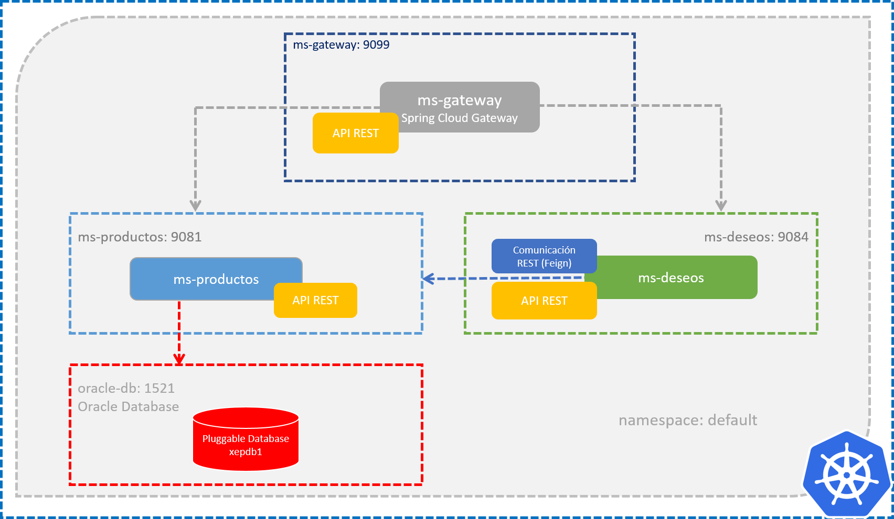

# Práctica 5.1 Spring Cloud Gateway

## Objetivo

- Al finalizar esta práctica, serás capaz de implementar y configurar un servicio de Spring Cloud Gateway en un clúster de Kubernetes. Esto incluye la creación y configuración del servicio, el enrutamiento de microservicios a través del Gateway utilizando `application.properties` y `application.yml`, la dockerización del Gateway, y el despliegue mediante Deployment y Service en Kubernetes, verificando su funcionalidad a través de Postman.
 

## Duración

60 minutos

 

## Objetivo Visual

 

## Instrucciones
